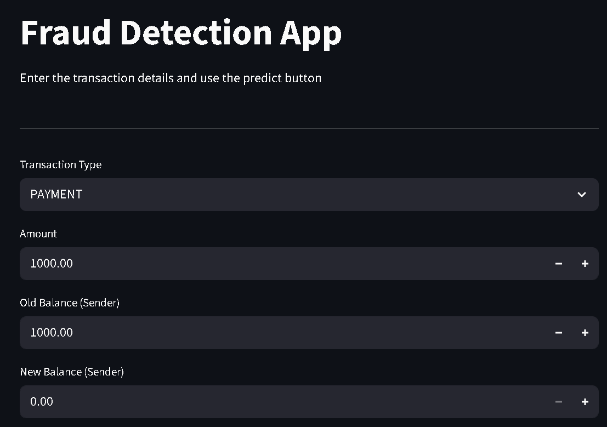

# Fraud Detection using Machine Learning

A machine learning project that detects fraudulent transactions in real time using a trained ML model and a Streamlit web app.

## App Preview

## Project Files
- `fraud_detection.py` — Streamlit web app for real time fraud detection
- `analysis_project.ipynb` — Data analysis, preprocessing and model training
- `fraud_detection_pipline.pkl` — Trained machine learning pipeline model

## Dataset
The dataset is not included in this repository due to its large size (470MB).
You can download it from Kaggle and place it in the project folder before running.

## How to Run
1. Download the dataset and place it in the project folder
2. Install the required libraries:

pip install streamlit pandas scikit-learn numpy
3. Run the app:
python -m streamlit run fraud_detection.py

## How it Works
1. User enters transaction details like Transaction Type, Amount, and Balance
2. The trained ML model analyzes the input
3. The app predicts whether the transaction is **Fraudulent or Not**

## Tech Stack
- Python
- Scikit-learn
- Streamlit
- Pandas
- Jupyter Notebook

## Author
Devanarayanan